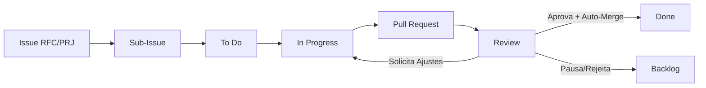

# Governança e Fluxo de Trabalho

Este documento define os padrões de engenharia da organização.  
Nosso objetivo é um fluxo colaborativo assíncrono, rastreável e focado em entregas consistentes, sem burocracia desnecessária.

## 1. Code Review e Sincronização

* **Sem Issue, sem código**: Todo trabalho relevante é planejado via Issues e entregue via Pull Requests.
* **Revisão**: Branch `main` é protegida nos repositórios de projeto. Todo PR exige revisão (`CODEOWNERS`), CI verde (ex: pytest, ruff).
* **Alinhamento**: Segunda-feira é preferencial para revisar PRs e alinhar prioridades. Ideias em amadurecimento usam Draft PRs.

## 2. Ciclo de Vida e Documentação

* Projetos nascem como RFCs no repositório `project-hub`. Ao entrarem em execução, ganham repositório dedicado.
* O `DESIGN.md` é a única fonte da verdade arquitetural. Ele migra para o repositório do projeto e evolui com o código.

## 3. Padrões Técnicos

* **Segredos**: Nunca versione credenciais, tokens ou dados reais. Todo projeto deve ter `.env.example` e `.gitignore` rigoroso.
* **Ambiente**: Docker e `docker-compose` são o padrão para projetos executáveis a partir do primeiro commit de aplicação.
* **Low-Code / Cloud**: Foco em IaC (se aplicável), exportações higienizadas e documentação visual (diagramas e checklists).

## 4. Rastreabilidade e Gestão

Nossa gestão visual é centralizada no GitHub Project da organização.

* **Issue Pai**: `\[RFC]` (ideação), `\[PRJ]` (projeto em execução) ou `\[ORG]` (governança).
* **Sub-issues**: Trabalho executável com prefixos claros (`\[FEAT]`, `\[FIX]`, `\[DOC]`, `\[CHORE]`, `\[REFACTOR]`, `\[ADR]`).
* **Regra**: 1 Sub-issue = 1 PR. A descrição do PR deve conter `Closes #ID\_DA\_SUBISSUE`.

## Visão Geral do Fluxo

